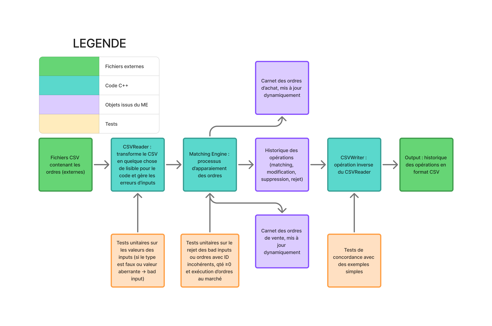

# Développement d'un Matching Engine en C++


## Introduction
**Auteurs** : Giovanni MANCHE, Timothée DANGLETERRE, Antonin DEVALLAND \
**Date** : Juin 2025 \
**Objet** : Réalisation d'un moteur de matching performant et robuste aux erreurs en C++ pour simuler l'exécution d'ordres selon les règles de priorité standards.

## Table des matières

- [Description](#description)
- [Fonctionnalités](#fonctionnalités)
  - [Types d'ordres supportés](#types-dordres-supportés)
  - [Actions disponibles](#actions-disponibles)
- [Fonctionnement du matching engine](#fonctionnement-du-matching-engine)
  - [Étapes](#étapes)
  - [Fonctionnalités principales](#fonctionnalités-principales)
  - [Gestion des erreurs robustes](#gestion-des-erreurs-robustes)
- [Installation](#installation)
  - [Prérequis](#prérequis)
  - [Compilation](#compilation)
- [Utilisation](#utilisation)
- [Format des fichiers](#format-des-fichiers)
  - [Fichier d'entrée (CSV)](#fichier-dentrée-csv)
  - [Fichier de sortie (CSV)](#fichier-de-sortie-csv)
- [Tests](#tests)
  - [Types de tests](#types-de-tests)
  - [Structure des tests](#structure-des-tests)
  - [Nettoyage](#nettoyage)
- [Architecture](#architecture)
  - [Structure du projet](#structure-du-projet)
  - [Classes principales](#classes-principales)
  - [Algorithme de matching](#algorithme-de-matching)

## Description
Ce projet implémente un **matching engine**, au coeur du trading financier. Il traite les ordres d'achat et de vente selon les règles de priorité standard :
- **Priorité du prix** : Les meilleurs prix sont exécutés en premier (les meilleurs ordres d'achat sont ceux dont le prix est le plus élevé, inversement pour les ordres de vente)
- **Priorité temporelle** : À prix égal, les ordres sont traités selon le principe *FIFO (First In, First Out)*

Ce matching engine supporte les opérations essentielles d'un carnet d'ordres avec gestion robuste complète des erreurs et validation des données.

## Fonctionnalités

### Types d'ordres supportés
- **LIMIT** : Ordres avec prix limite spécifique. Ces ordres sont maintenus dans le carnet tant qu'ils ne sont pas entièrement exécutés ou supprimés.
- **MARKET** : Ordres au prix du marché (exécution immédiate, ou rejet immédiat). Ces ordres disparaissent du carnet après exécution partielle. 

### Actions disponibles
- **NEW** : Ajout d'un nouvel ordre au carnet
- **MODIFY** : Modification d'un ordre existant. Il est possible de modifier le prix et la quantité. Attention, la modification fait perdre la priorité temporelle qu'aurait eu l'ordre non modifié. Aussi, une modification de la quantité fonctionne selon la logique suivante si l'ordre a déjà été partiellement exécuté :
$$
\text{newQty} = \text{remainingQty} - (\text{initialQty} - \text{modifiedQty})  
$$
- Si la modification est d'une ampleur telle que la quantité deviendrait négative, l'ordre est simplement considéré comme exécuté et $\text{newQty} = 0$.

- **CANCEL** : Annulation d'un ordre existant

## Fonctionnement du matching engine 
### Étapes
Le matching engine repose sur 3 étapes essentielles : 
- Lecture d'un CSV contenant les ordres à exécuter,
- Récupération des ordres un à un et recherche de matching possibles, et exécution des actions demandées si l'ordre est de type MODIFY ou CANCEL,
- Une fois tous les ordres lus, renvoi au format CSV 
Les carnets d'ordre sont maintenus à jour dynamiquement à l'aide d'objets `map` et `priority_queue`, tandis que l'historique des opérations est actualisé à chaque étape.

### Fonctionnalités principales
- Validation complète des données d'entrée
- Gestion des erreurs avec type `BAD_INPUT`
- Exécutions partielles et complètes
- Traitement multi-instruments (produit des outputs différents pour chaque instrument)
- Logs détaillés pour debugging
- Format de sortie standardisé

### Gestion des erreurs robustes
Si le format des données CSV est erroné (valeurs négatives, mauvais type,...), alors : 
- le type sera fixé à BAD_INPUT, les valeurs chiffrées à 0 
- le matching engine rejettera automatiquement ce type d'ordre (donc les modifications des valeurs n'ont pas d'effet),
- dans l'historique des opérations, l'ordre sera indiqué de type "BAD_INPUT" et d'état "REJECTED".

Cette méthode permet de ne pas forcer l'arrêt du matching engine en cas d'erreur localisée et inattendue, tout en ne faussant pas l'exécution. 

Le matching engine gère également les cas où : 
- l'ID d'un ordre CANCEL ou MODIFY n'existe pas encore,
- l'ID d'un ordre NEW existe déjà,
- la modification de la quantité avec un ordre MODIFY aboutit à une quantité négative,
- un ordre au marché ne trouve aucune contrepartie (carnet d'ordres opposés vide).

## Installation

### Prérequis
- **Compilateur** : g++ avec support C++17 ou supérieur
- **Build system** : make
- **Système** : Linux/macOS

### Compilation
Le nom de l'exécutable du matching engine est `order_book`
```bash
# Pour cloner le projet depuis Github
git clone <repository-url>
cd matching-engine-cpp

# Compilation complète
make clean ; make all 

# Vérification (affichage des loggers)
ls build/order_book
```

## Utilisation

### Lancement basique
```bash
# Lancement avec fichier par défaut
make run

# Ou directement
./build/order_book
```

### Modifier le fichier d'entrée
La modification du fichier d'input se fait depuis le fichier `main.cpp` :
```cpp
int main() {
    // Chargement des ordres
    CsvReader csvReader("Inputs/input_with_market_orders.csv");  // <- Vous pouvez modifier ici !
    csvReader.init();
    csvReader.Display();
```

## Format des fichiers

### Fichier d'entrée (CSV)
```csv
timestamp,order_id,instrument,side,type,quantity,price,action
1617278400000000000,1,AAPL,BUY,LIMIT,100,150.25,NEW
1617278400000000100,2,AAPL,SELL,LIMIT,50,150.25,NEW
1617278400000000200,1,AAPL,BUY,LIMIT,100,150.30,MODIFY
1617278400000000300,2,AAPL,SELL,LIMIT,50,150.25,CANCEL
```

#### Colonnes requises
| Colonne | Type | Description |
|---------|------|-------------|
| `timestamp` | long long | Horodatage en nanosecondes (époque Unix) |
| `order_id` | int | Identifiant unique de l'ordre |
| `instrument` | string | Code de l'instrument (ex: "AAPL", "EURUSD") |
| `side` | string | Côté de l'ordre (`BUY` ou `SELL`) |
| `type` | string | Type d'ordre (`LIMIT` ou `MARKET`) |
| `quantity` | int | Quantité à acheter/vendre (>0) |
| `price` | float | Prix limite (pour LIMIT), 0 pour MARKET |
| `action` | string | Action (`NEW`, `MODIFY`, `CANCEL`) |

### Fichier de sortie (CSV)
```csv
timestamp,order_id,instrument,side,type,quantity,price,action,status,executed_quantity,execution_price,counterparty_id
1617278400000000000,1,AAPL,BUY,LIMIT,100,150.25,NEW,PENDING,0,0,0
1617278400000000100,2,AAPL,SELL,LIMIT,0,150.25,NEW,EXECUTED,50,150.25,1
1617278400000000100,1,AAPL,BUY,LIMIT,50,150.25,NEW,PARTIALLY_EXECUTED,50,150.25,2
1617278400000000200,1,AAPL,BUY,LIMIT,50,150.30,MODIFY,PARTIALLY_EXECUTED,50,150.25,2
1617278400000000300,2,AAPL,SELL,LIMIT,50,150.25,CANCEL,REJECTED,0,0,0
```

#### Colonnes supplémentaires de sortie
| Colonne | Description |
|---------|-------------|
| `status` | `EXECUTED`, `PARTIALLY_EXECUTED`, `PENDING`, `CANCELED`, `REJECTED` |
| `executed_quantity` | Quantité effectivement exécutée |
| `execution_price` | Prix d'exécution réel |
| `counterparty_id` | ID de l'ordre contrepartie lors d'un match |

## Tests

### Types de tests
Nous avons à disposition une multitude de tests visant à mettre à l'épreuve la robustesse de notre matching engine et sa gestion des exceptions. On distingue trois principales catégories de tests :
- Tests unitaires de gestion des exceptions à la lecture du CSV : on vérifie que, pour chaque potentielle erreur de typage / valeur, l'ordre est bien transformé en un type BAD_INPUT avec valeurs nulles. L'exécutable associé est `test_csv_reader`
- Tests unitaires de gestion des incohérences et exceptions dans le matching engine : on vérifie que les ordres labellisés BAD_INPUT sont automatiquement rejetés, que les ordres avec des IDs incohérents le sont aussi, et que les ordres modifiant la quantité ne la rendent jamais négative. L'exécutable associé est `test_matching_engine`
- Tests de conformité avec des résultats connus : ces tests permettent de tester de manière globale le code. On crée des inputs simples de toute pièce dont on connaît l'output attendu, et nous vérifions que l'output généré par le code est conforme aux attentes. L'exécutable associé est `test_outputs` 

Vous pouvez lancer tous les tests en même temps ou une batterie spécifique à la fois :
```bash
# Pour lancer tous les tests : 
make test_all

# Pour lancer les tests portant sur une partie spécifique : 
make test_matching_engine    # Tests unitaires du moteur
make test_outputs           # Tests de conformité
make test_csv_reader        # Tests du lecteur CSV
```

### Structure des tests
```
tests/
├── MatchingEngine/         # Tests unitaires du moteur
├── SimpleOutput/           # Tests de concordance
│   ├── Inputs/            # Fichiers de test
│   ├── ExpectedOutputs/   # Résultats attendus
│   └── GeneratedOutputs/  # Résultats générés
└── CSVReader/             # Tests du lecteur CSV
```

### Nettoyage
```bash
make clean    
```

## Architecture

### Structure du projet
```
matching-engine/
├── src/
│   ├── core/
│   │   └── MatchingEngine.cpp    # Logique principale du matching
│   └── data/
│       ├── CSVReader.cpp         # Lecture et validation CSV
│       └── CSVWriter.cpp         # Écriture des résultats
├── includes/
│   ├── core/
│   │   └── MatchingEngine.h      # Interface du moteur
│   └── data/
│       ├── CSVReader.h
│       └── CSVWriter.h
├── tests/                        # Tests unitaires et d'intégration
├── build/                        # Fichiers compilés
├── Inputs/                       # Fichiers CSV d'entrée pour la main
├── Outputs/                      # Fichiers CSV en sortie du code
├── docs/                         # Fichiers et images annexes
├── main.cpp                      # Point d'entrée principal
└── Makefile                      
```

### Classes principales

#### `MatchingEngine`
- **Responsabilité** : Traitement des ordres selon les règles de marché. C'est le coeur du code.
- **Algorithme** : Priority queue pour gestion FIFO avec priorité prix
- **Complexité** : O(log n) pour insertion, O(1) pour meilleur prix

#### `CsvReader`
- **Responsabilité** : Lecture et validation des fichiers CSV
- **Validation** : Types de données, contraintes métier, gestion d'erreurs
- **Support** : Multi-instruments avec groupement automatique

#### `CsvWriter`
- **Responsabilité** : Sérialisation des résultats au format CSV
- **Format** : Compatible avec spécifications du projet

### Algorithme de matching
1. **Tri par timestamp** (si nécessaire)
2. **Pour chaque ordre** :
   - Validation des données
   - Gestion de l'action (NEW/MODIFY/CANCEL)
   - Tentative de matching avec carnet opposé
   - Mise à jour du carnet et de l'historique
3. **Gestion des exécutions partielles**
4. **Logging détaillé** de chaque opération
---
Vous trouverez ci-dessous une vision schématisée du code (code couleur indiqué par le tableau).
