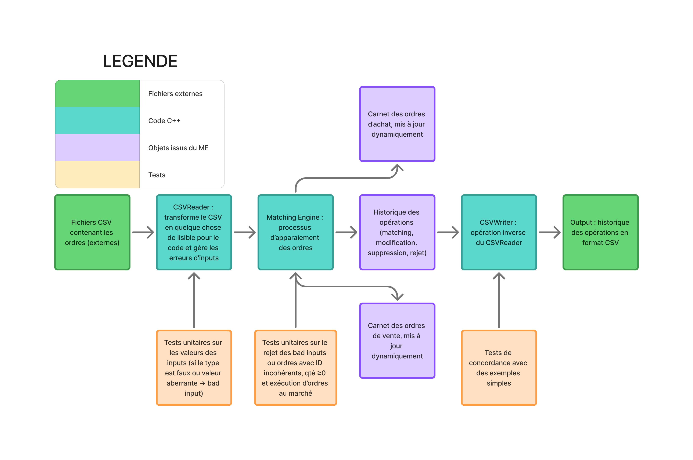

# Development of a Matching Engine in C++


## Introduction
**Authors**: Giovanni MANCHE, Timothée DANGLETERRE, Antonin DEVALLAND  
**Date**: June 2025  
**Purpose**: Implementation of a high-performance and error-robust matching engine in C++ to simulate order execution according to standard priority rules.

## Table of Contents

- [Description](#description)
- [Features](#features)
  - [Supported Order Types](#supported-order-types)
  - [Available Actions](#available-actions)
- [Matching Engine Operation](#matching-engine-operation)
  - [Steps](#steps)
  - [Main Features](#main-features)
  - [Robust Error Handling](#robust-error-handling)
- [Installation](#installation)
  - [Prerequisites](#prerequisites)
  - [Compilation](#compilation)
- [Usage](#usage)
- [File Formats](#file-formats)
  - [Input File (CSV)](#input-file-csv)
  - [Output File (CSV)](#output-file-csv)
- [Tests](#tests)
  - [Test Types](#test-types)
    - [Unit Tests](#unit-tests)
    - [Compliance Tests with Known Results](#compliance-tests-with-known-results)
    - [Performance Tests](#performance-tests)
  - [Test Structure](#test-structure)
  - [Cleanup](#cleanup)
- [Architecture](#architecture)
  - [Project Structure](#project-structure)
  - [Main Classes](#main-classes)
  - [Matching Algorithm](#matching-algorithm)

## Description
This project implements a **matching engine**, at the heart of financial trading. It processes buy and sell orders according to standard priority rules:
- **Price Priority**: The best prices are executed first (the best buy orders are those with the highest price, inversely for sell orders)
- **Time Priority**: At equal prices, orders are processed according to the *FIFO (First In, First Out)* principle

This matching engine supports essential order book operations with complete robust error handling and data validation.

## Features

### Supported Order Types
- **LIMIT**: Orders with a specific limit price. These orders remain in the order book until they are fully executed or deleted.
- **MARKET**: Market price orders (immediate execution or immediate rejection). These orders disappear from the order book after partial execution.

### Available Actions
- **NEW**: Add a new order to the order book
- **MODIFY**: Modify an existing order. It is possible to modify the price and quantity. Note that modification causes loss of the time priority that the unmodified order would have had. Also, a quantity modification works according to the following logic if the order has already been partially executed:
```math
\text{newQty} = \text{remainingQty} - (\text{initialQty} - \text{modifiedQty})  
```
- If the modification is of such magnitude that the quantity would become negative, the order is simply considered executed and $\text{newQty} = 0$.

- **CANCEL**: Cancel an existing order

## Matching Engine Operation
### Steps
The matching engine relies on 3 essential steps:
- Reading a CSV containing the orders to be executed,
- Retrieving orders one by one and searching for possible matches, and executing requested actions if the order is of type MODIFY or CANCEL,
- Once all orders are read, return in CSV format

Order books are maintained dynamically using `map` and `priority_queue` objects, while the operation history is updated at each step.

### Main Features
- Complete input data validation
- Error handling with `BAD_INPUT` type
- Partial and complete executions
- Multi-instrument processing (produces different outputs for each instrument)
- Detailed logs for debugging
- Standardized output format

### Robust Error Handling
If the CSV data format is incorrect (negative values, wrong type, etc.), then:
- the type will be set to BAD_INPUT, numerical values to 0
- the matching engine will automatically reject this type of order (so value modifications have no effect),
- in the operation history, the order will be indicated as type "BAD_INPUT" and status "REJECTED".

This method allows the matching engine not to be forced to stop in case of localized and unexpected error, while not distorting execution.

The matching engine also handles cases where:
- the ID of a CANCEL or MODIFY order does not yet exist,
- the ID of a NEW order already exists,
- quantity modification with a MODIFY order results in a negative quantity,
- a market order finds no counterparty (opposite order book empty).

## Installation

### Prerequisites
- **Compiler**: g++ with C++17 support or higher
- **Build system**: make
- **System**: Linux/macOS

### Compilation
The matching engine executable name is `order_book`
```bash
# To clone the project from Github
git clone <repository-url>
cd matching-engine-cpp

# Complete compilation
make clean ; make all 

# Verification (display loggers)
ls build/order_book
```

## Usage

### Basic Launch
```bash
# Launch with default file
make run

# Or directly
./build/order_book
```

### Modify Input File
Input file modification is done from the `main.cpp` file:
```cpp
int main() {
    // Load orders
    CsvReader csvReader("Inputs/input_with_market_orders.csv");  // <- You can modify here!
    csvReader.init();
    csvReader.Display();
```

## File Formats

### Input File (CSV)
```csv
timestamp,order_id,instrument,side,type,quantity,price,action
1617278400000000000,1,AAPL,BUY,LIMIT,100,150.25,NEW
1617278400000000100,2,AAPL,SELL,LIMIT,50,150.25,NEW
1617278400000000200,1,AAPL,BUY,LIMIT,100,150.30,MODIFY
1617278400000000300,2,AAPL,SELL,LIMIT,50,150.25,CANCEL
```

#### Required Columns
| Column | Type | Description |
|---------|------|-------------|
| `timestamp` | long long | Timestamp in nanoseconds (Unix epoch) |
| `order_id` | int | Unique order identifier |
| `instrument` | string | Instrument code (e.g., "AAPL", "EURUSD") |
| `side` | string | Order side (`BUY` or `SELL`) |
| `type` | string | Order type (`LIMIT` or `MARKET`) |
| `quantity` | int | Quantity to buy/sell (>0) |
| `price` | float | Limit price (for LIMIT), 0 for MARKET |
| `action` | string | Action (`NEW`, `MODIFY`, `CANCEL`) |

### Output File (CSV)
```csv
timestamp,order_id,instrument,side,type,quantity,price,action,status,executed_quantity,execution_price,counterparty_id
1617278400000000000,1,AAPL,BUY,LIMIT,100,150.25,NEW,PENDING,0,0,0
1617278400000000100,2,AAPL,SELL,LIMIT,0,150.25,NEW,EXECUTED,50,150.25,1
1617278400000000100,1,AAPL,BUY,LIMIT,50,150.25,NEW,PARTIALLY_EXECUTED,50,150.25,2
1617278400000000200,1,AAPL,BUY,LIMIT,50,150.30,MODIFY,PARTIALLY_EXECUTED,50,150.25,2
1617278400000000300,2,AAPL,SELL,LIMIT,50,150.25,CANCEL,REJECTED,0,0,0
```

#### Additional Output Columns
| Column | Description |
|---------|-------------|
| `status` | `EXECUTED`, `PARTIALLY_EXECUTED`, `PENDING`, `CANCELED`, `REJECTED` |
| `executed_quantity` | Actually executed quantity |
| `execution_price` | Actual execution price |
| `counterparty_id` | ID of the counterparty order during a match |

## Tests

### Test Types
We have a multitude of tests available aimed at testing the robustness of our matching engine and its exception handling. We distinguish three main categories of tests.

#### Unit Tests
- Unit tests for exception handling when reading CSV: we verify that, for each potential typing/value error, the order is properly transformed into a BAD_INPUT type with null values. The associated executable is `test_csv_reader`
- Unit tests for handling inconsistencies and exceptions in the matching engine: we verify that orders labeled BAD_INPUT are automatically rejected, that orders with inconsistent IDs are also rejected, and that orders modifying quantity never make it negative. The associated executable is `test_matching_engine`

#### Compliance Tests with Known Results
- These tests allow global code testing. We create simple inputs from scratch whose expected output is known, and we verify that the output generated by the code conforms to expectations. The associated executable is `test_outputs`

#### Performance Tests
They measure matching engine efficiency via five metrics:
- **overall execution time** in seconds (from CSVReader to CSVWriter),
- **throughput**, i.e., the number of orders processed per second by the matching engine,
- **latency**, i.e., the average time required to process an individual order (in microseconds),
- **memory**, measured by the actual RAM consumption of the process during execution (returned measure: maximum usage).
- **scalability**, i.e., performance evolution with increasing order volume. This is not a metric *per se*, but we can compare the evolution of previous metrics with CSV files containing 10, 100, 1,000, 10,000, or 100,000 orders. This allows identification of real algorithmic complexity.

With the currently proposed input files, we obtain the following metrics:
```
===============================================================
COMPARATIVE PERFORMANCE SUMMARY
================================================================================
File                     Nb Orders      Time (s)       Orders/sec     Latency (µs)  Memory (KB)
--------------------------------------------------------------------------------------------------------------
10_orders.csv            10             0.001          14225          70.30          2092
100_orders.csv           100            0.005          20321          49.21          4008
1000_orders.csv          1000           0.071          14046          71.19          4292
10000_orders.csv         10000          0.693          14431          69.29          7276
100000_orders.csv        100000         5.744          17408          57.44          17328
--------------------------------------------------------------------------------------------------------------
```
These results demonstrate good scalability and quasi-linear complexity $O(n)$ (by multiplying the number of orders by 10, execution time is multiplied by approximately 10)

#### Running Tests

You can run all tests at once or a specific battery at a time:
```bash
# To run all tests (note: performance tests are NOT included): 
make test_all

# To run tests for a specific part: 
make test_matching_engine    # Engine unit tests
make test_outputs           # Compliance tests
make test_csv_reader        # CSV reader tests
make test_performance       # Performance tests
```

### Test Structure
```
tests/
├── MatchingEngine/         # Engine unit tests
├── SimpleOutput/           # Compliance tests
│   ├── Inputs/            # Test files
│   ├── ExpectedOutputs/   # Expected results
│   └── GeneratedOutputs/  # Generated results
└── CSVReader/             # CSV reader tests
```

### Cleanup
```bash
make clean    
```

## Architecture

### Project Structure
```
matching-engine/
├── src/
│   ├── core/
│   │   └── MatchingEngine.cpp    # Main matching logic
│   └── data/
│       ├── CSVReader.cpp         # CSV reading and validation
│       └── CSVWriter.cpp         # Result writing
├── includes/
│   ├── core/
│   │   └── MatchingEngine.h      # Engine interface
│   └── data/
│       ├── CSVReader.h
│       └── CSVWriter.h
├── tests/                        # Unit and integration tests
├── build/                        # Compiled files
├── Inputs/                       # Input CSV files for main
├── Outputs/                      # CSV output files from code
├── docs/                         # Appendix files and images
├── main.cpp                      # Main entry point
└── Makefile                      
```

### Main Classes

#### `MatchingEngine`
- **Responsibility**: Order processing according to market rules. This is the core of the code.
- **Algorithm**: Priority queue for FIFO management with price priority
- **Complexity**: O(log n) for insertion, O(1) for best price

#### `CsvReader`
- **Responsibility**: Reading and validating CSV files
- **Validation**: Data types, business constraints, error handling
- **Support**: Multi-instrument with automatic grouping

#### `CsvWriter`
- **Responsibility**: Serializing results to CSV format
- **Format**: Compatible with project specifications

### Matching Algorithm
1. **Sort by timestamp** (if necessary)
2. **For each order**:
   - Data validation
   - Action handling (NEW/MODIFY/CANCEL)
   - Attempt matching with opposite order book
   - Update order book and history
3. **Partial execution handling**
4. **Detailed logging** of each operation

---
Below you will find a schematic view of the code (color code indicated by the table).

